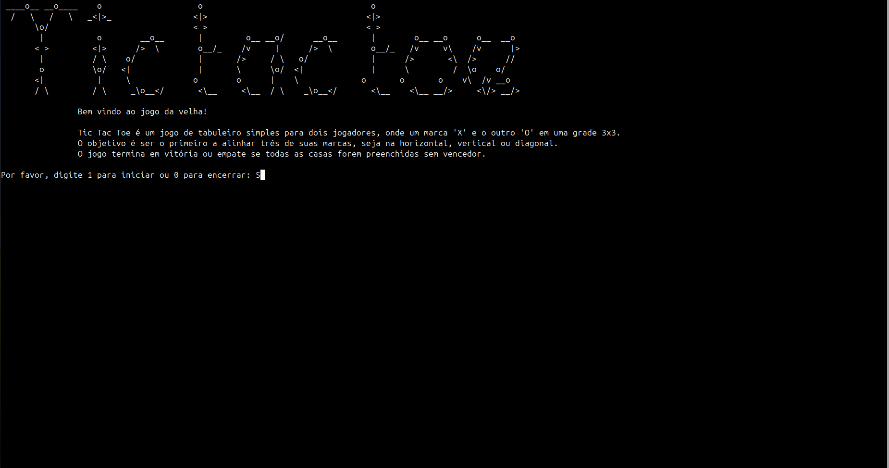

# Tic Tac Toe

> Tic Tac Toe é um jogo de tabuleiro clássico onde dois jogadores competem em um tabuleiro 3x3. O objetivo é alinhar três marcas em uma linha, coluna ou diagonal.

## 💻 Pré-requisitos

Antes de começar, verifique se você atendeu aos seguintes requisitos:

- Você instalou a versão mais recente do GCC.
- Você tem uma máquina Linux ou macOS. O jogo pode não ser compatível com Windows sem ajustes.
- Você leu a documentação do GCC.

## 🚀 Instalando Tic Tac Toe

Para instalar o Tic Tac Toe, siga estas etapas:

Linux e macOS:
	 <code>git clone [https://github.com/seu-usuario/tic-tac-toe.git](https://github.com/seu-usuario/tic-tac-toe.git)</code> 
  <code>cd tic-tac-toe</code> 
	<code>gcc -o tic-tac-toe main.c</code>

Windows:
 <code>git clone [https://github.com/seu-usuario/tic-tac-toe.git](https://github.com/seu-usuario/tic-tac-toe.git)</code> 
  <code>cd tic-tac-toe</code> 
	<code>gcc -o tic-tac-toe main.c</code>

## ☕ Usando Tic Tac Toe

Para usar Tic Tac Toe, siga estas etapas:

<code>./tic-tac-toe</code>

Inicie o jogo e siga as instruções na tela para jogar com um amigo!

## 📫 Contribuindo para Tic Tac Toe

Para contribuir com Tic Tac Toe, siga estas etapas:

1. Bifurque este repositório.
2. Crie um branch: `git checkout -b minha-nova-feature`.
3. Faça suas alterações e confirme-as: `git commit -m 'Adicionando nova feature'`.
4. Envie para o branch original: `git push origin minha-nova-feature`.
5. Crie a solicitação de pull.
